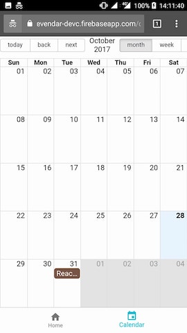
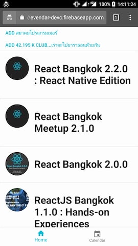
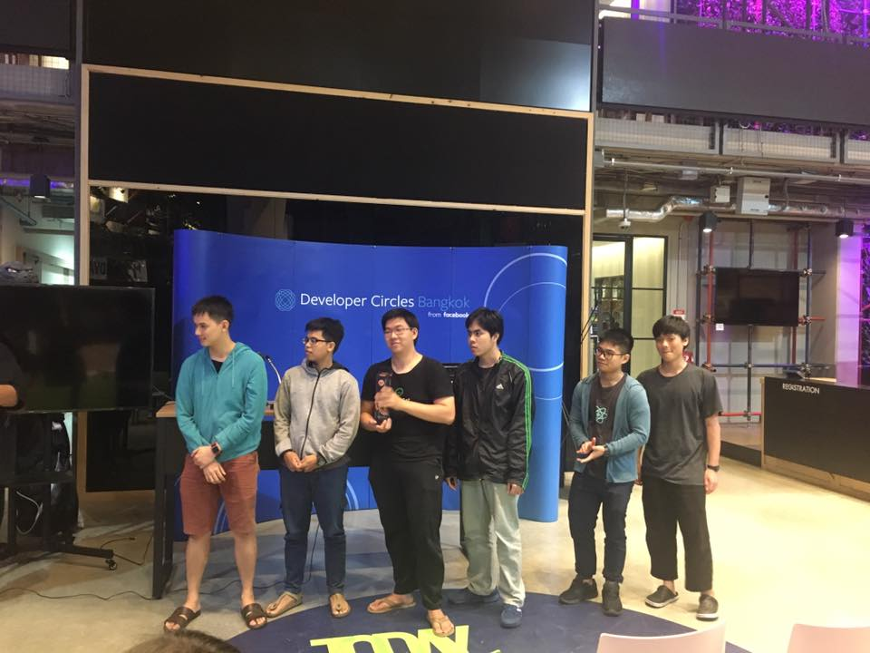

# evandar
See events that matter.

Our group made the project in [DevC: First Meetup and Hackathon](https://www.facebook.com/events/148584322421822/).

The idea of `evendar` (Event + Radar) is to make people can manage the events.

You can see the detail in [Slide](https://docs.google.com/presentation/d/1z4A9jllOLAnGvwDE8gWHHYWLsnDwIVWPA3jTZltOlPE/edit?usp=sharing).

Why the name is evendar
Evendar = Event + Radar

## Commands
- `npm start`
- `npm run build`

## Screenshots

## Demo
https://evendar-devc.firebaseapp.com

## Contributors

Fullname | Github
------------ | -------------
Supanut Apikulvanich | [@zugarzeeker](https://github.com/zugarzeeker)
? | ?
? | ?
? | ?
? | ?
? | ?
